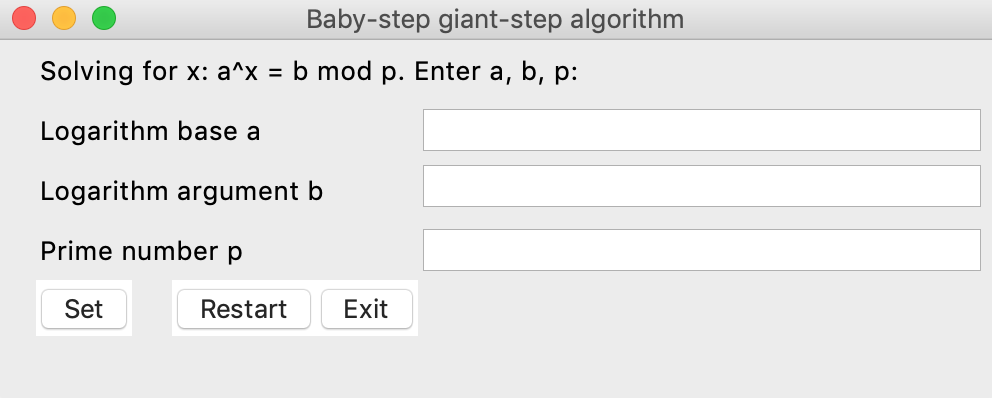
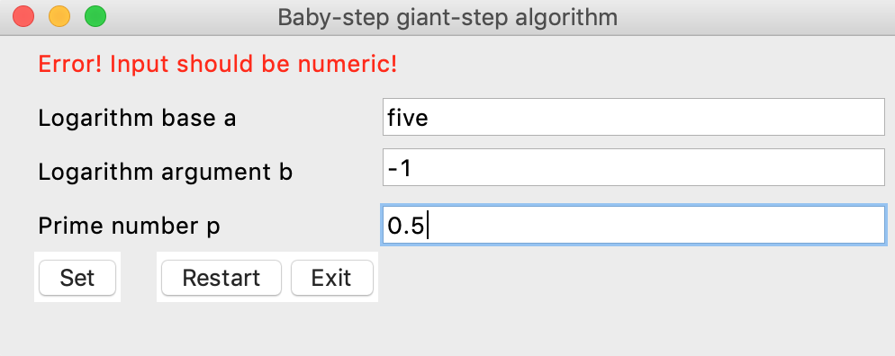
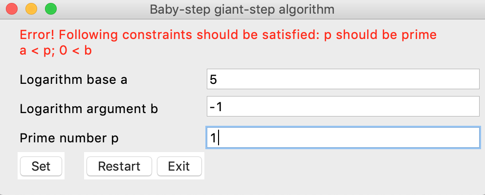
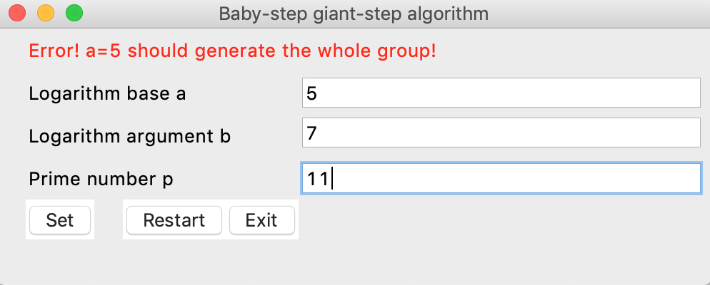

# Overview
GUI implementation with tkinter of ["Baby-step giant-step algorithm"](https://en.wikipedia.org/wiki/Baby-step_giant-step) for [discrete logarithm](https://en.wikipedia.org/wiki/Discrete_logarithm) problem (logarithm in arbitrary group) computation. Discrete logarithms
 is important concept in public-key cryptography and in fact several important algorithms in public-key cryptography base their security on the assumption that the discrete logarithm problem over carefully chosen groups has no efficient solution.

This tool was created for *educational purposes* for interactive step-by-step calculation of dicrete logarithm in a given cyclic group. (note, however, that this algorithm is not efficient enough for crypto-attacks)

# Installation
You must have Python version >= 3.6 installed.

After you installed Python clone this github repo:
`git clone https://github.com/vzhenylenko/shanks-gui` 

Run script:
`python shanks_app.py`

# Features
This implementation offers custom entries of a, b, p in a^x=b(mod p) equation.

 

#### Validation
After you input a, b, p and click "Set", program checks several simple constraints on inputs such as:
1. a, b, p supposed to be positive integers
2. p  has to be prime and not exceed p_limit.
3. a should generate a full cyclic group of order p under multiplication

If some of conditions are not satisfied, application prompt list of errors.

 
 
 

#### Individual steps updates
After validation of a, b, p app enters to algorithm view. By clicking "Previous Step" or
"Next Step" you could navigate across steps in the algorithm.
 

#### Restart & Exit
You could go back to initial view by clicking "Restart" or close window by clicking "Exit".
 

# Author
Viacheslav Zhenylenko

# Licence
You could use this code for free without any restrictions.

